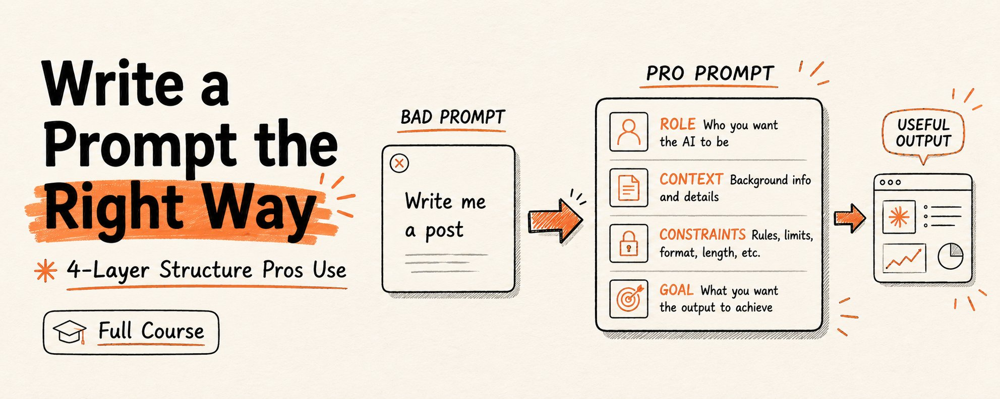

# How to write a prompt the right way: the 4-layer structure pros use



I went through Anthropic's official prompt engineering docs, their internal courses, and a talk by one of their applied AI engineers on how the Claude team actually debugs prompts in production.

Bookmark this. Save it. Then I compressed everything into one structure. Four layers. Build them in order and you get prompts that survive model migrations, edge cases, and production traffic.

That is not hyperbole. After this you will never write a prompt as a single sentence again — because you will see why that was the problem the whole time.

## The lie everyone believes about prompting

Most people treat prompting like a Google search.

Type a vague sentence. Hit enter. Hope. If the output is bad, add more words. Still bad? Add "IMPORTANT." Add "CRITICAL." Add "always" and "never" until something sticks.

Anthropic's own documentation calls this out directly: most people **"type a vague sentence, hit enter, and hope for the best. Then they wonder why the output sounds generic or misses the mark entirely."**

Here is the truth nobody tells you. A prompt is not a sentence. **It is a system with four layers, and each layer does a different job.**


Amateurs write Layer 2 and stop. Pros build all four, in order.

---

## 01. Make the prompt parseable

Before you optimize anything, you organize.

Anthropic's number one structural recommendation is XML tags. Not because they look clean — **because Claude was specifically trained to recognize XML structure.** When a prompt has multiple components, tags stop the model from mixing them up.

The Anthropic team has a rule of thumb that cuts to the core of it: if you are reading a prompt and you cannot tell guidelines from policy from data, the model probably cannot either.

### What the pros actually tag

There are no "correct" tag names — Anthropic is explicit about this. But the common patterns are worth memorizing:

```
<instructions> — the task steps
<context> — background the model needs
<data> — the actual input to work on
<examples> — sample inputs and outputs
<thinking> — where the model reasons
<answer> — where the final output goes
<output_format> — the exact shape you want back
```

A structured prompt separates every concern cleanly:

```
<role>
You are a senior support agent for a telecom company.
</role>

<policy>
- Grandfathered plans use the customer's account data
- Never quote public pricing to a legacy customer
</policy>

<guidelines>
- Warm, concise tone; under 100 words
</guidelines>

<data>{customer_account_context}</data>

<user_message>{the actual question}</user_message>
```

Same words jammed into one paragraph give you completely different reliability. The tags are the difference.

### The order matters more than you think

One detail almost nobody knows, straight from Anthropic's long-context guidance: **put long documents at the top of your prompt, above your instructions and your question.** Queries placed at the end can improve response quality by up to 30% on long-context tasks.

Same prompt, same model — just moving the question to the bottom buys you up to 30%. That is the cheapest performance gain in prompting, and it costs you nothing.


### The cleanup pass

Anthropic's engineers do something most people never do: **they delete.**

Production prompts accumulate patches. An instruction added to fix one model's quirk. A "CRITICAL: never do X" bolted on after one bad output. A block someone pasted from a website, hero-image reference and cookie notice still attached. Every one of those is now noise the model has to wade through. Strip out everything that no longer earns its place.

---

## 02. Aim the model at the target

Now that the model can read the prompt, you tell it where to go. This is the layer most people think is prompting. It is one of four. Direction has four official Anthropic techniques — use them in this order.

**1 — Give Claude a role.** Anthropic calls role prompting "the most powerful way to use system prompts with Claude." The official guidance is specific: put the role in the system prompt, put task instructions in the user turn. Role up top, task below.

```
System:
You are a financial analyst who values precision over hedging,
writing for an audience that knows the basics.

User:
[the actual task]
```

**2 — Be clear and direct.** Anthropic's research found Claude performs best when the prompt names the task explicitly, identifies who the output is for, and defines what "done" looks like before generation begins. The test: could a new employee follow your prompt with zero context? If not, **the fault is the prompt, not the model.**

**3 — Use examples (multishot).** The highest-leverage technique most people skip. Anthropic's recommendation: one to three examples of input and desired output, wrapped in `<examples>` tags. A single concrete example of the output you want is worth more than fifty lines of adjectives describing it.

**4 — Let Claude think.** For analysis, math, or multi-step logic, tell the model to reason before it answers. Anthropic's one firm rule: **always have Claude output its thinking.** Reasoning in a hidden scratchpad you cannot see may as well not have happened.

```
Think through this step by step inside <thinking> tags.
Then give your final answer inside <answer> tags.
```

XML tags holding role, examples, and explicit reasoning, all separated cleanly — that is what Anthropic calls a "super-structured, high-performance prompt." Layer 1 and Layer 2 working together.

---

## 03. Give it the ability to actually do it

Here is the most counterintuitive lesson from the Anthropic engineering talk — the one that separates people who understand models from people who do not.

**Instructions do not add capability.**

In the talk, a support bot kept giving customers vague answers to billing calculations. The original prompt screamed at it: **"CRITICAL. Always calculate any prorated amounts correctly. Never give a vague answer."**

It did not work. It could never work. Telling a model it is critical to do mental math correctly does not make it better at mental math. The instruction was aimed at a problem instructions cannot solve.

### The fix is a tool, not a sentence

Instead of louder instructions, they gave the model a calculator tool. Defined it, told the model when to use it, implemented the math behind it. Result: every test case passed. The model reasoned about the problem and used the tool to execute it reliably.

This is the mental shift. When a prompt fails, ask whether you face a **direction problem** or a **capability problem:**

- **Direction problem** → fix in Layer 2 (clearer role, better examples, explicit reasoning)
- **Capability problem** → fix in Layer 3 (give it a tool, or more reasoning budget)

No amount of Layer 2 wordsmithing fixes a Layer 3 gap. People burn hours rewording prompts when the real issue was that the model needed a tool all along.


### Reasoning budget is also capability

The same talk showed a scheduling agent failing on a hard constraint problem. A bigger model helped. Turning on adaptive thinking — letting the model decide how much to reason — made it reliably correct.

That is capability you add through the API and the harness, **not** through the prompt text. The lever is not always the words.

---

## 04. Prove it works. Keep it working.

This is the layer that turns prompting from guessing into engineering. And it is the one almost nobody builds.

Anthropic's documentation is blunt: before you optimize, you need a clear definition of success, a way to test against it, and a first-draft prompt to improve. **"Without these, you're optimizing blind."**

### Build a tiny eval suite

You do not need a research lab. The Anthropic talk used five test cases. The point is coverage, not volume. Three kinds of cases matter:

- **Control cases.** Unambiguous, should always pass. Your canary — if this breaks, something is badly wrong.
- **Edge cases.** Places the model failed before. Each one is a regression test that stops the failure from sneaking back.
- **Boundary cases.** Where the model should hand off to a human or refuse. Proof that it knows the limits of its own competence.

Run the prompt against all of them. Change one thing. Run again. Now you **know** whether your change helped — instead of believing it did because the one example you checked looked fine.

### State both sides of every trade-off

The subtlest lesson in the playbook, and it matters more as models get smarter. In the talk, a bot refused to escalate billing errors.

The prompt had said: **"avoid escalating unless absolutely necessary — it costs about $8 and counts against our metrics."** So the model optimized for not escalating. It followed orders perfectly.

The prompt only gave one side. It named the cost of escalating and never the cost of not escalating — a wrong answer, a refund, lost trust.

The fix: give both sides. As models get better at reasoning, **they optimize harder for the only goal you actually gave them.** A one-sided instruction that worked on a weaker model becomes a trap on a stronger one.

### Old patches become poison

The most surprising failure of the talk: a bot was **withholding information it actually had** — telling a customer "go check the website" instead of answering, even though the answer was right there in the account data.

The cause? An old patch. A previous model used to hallucinate plan details, so someone added "never give wrong plan details, point them to the URL." That patch made sense once. But newer models follow instructions more literally — so the same line now caused the model to clam up and hide correct information.

The fix is process, not wording: **version-control your prompts.** Record why every defensive instruction was added. On the next model migration, find those patches and ask whether they still earn their place — or whether they have quietly turned toxic.

---

## 05. How the 4 layers stack

Walk a real failure through the stack and the method becomes obvious. Your prompt is producing bad output. Instead of randomly adding words, you ask, in order:


Most people live entirely in Layer 2, rewording the same sentence forever. The professionals move through all four in order — **and the order is the whole trick.** Structure before direction. Direction before capability. Capability before you trust it. Verification underneath all of it.

### The anti-patterns to delete today

- **Stop stacking "CRITICAL" and "IMPORTANT."** Forceful language does not add capability. The model needs a tool or more reasoning, not louder instructions.
- **Stop one-sided instructions.** Every "avoid X" without the cost of avoiding X teaches the model to overfit. State both sides.
- **Stop hoarding old patches.** Instructions written for last year's model can poison this year's. Audit them on every migration.
- **Stop the wall of text.** If you cannot tell policy from guidelines from data, neither can the model. Tag everything.
- **Stop putting the question first on long inputs.** Documents at top, question at bottom. Up to 30% better.
- **Stop optimizing blind.** No evals means guessing. Five test cases beat zero every time.

---

## Conclusion

**"A prompt is not a sentence you write. It is a system you build."**

Most people will read this and keep writing prompts the way they always have. One sentence. Hit enter. Add "CRITICAL" when it fails. Decide the model is not that smart.

The ones who build the four layers will watch their prompts hold steady through model upgrades that break everyone else's — because they structured for parsing, directed with role and examples, supplied capability with tools, and verified with evals.


Pick one prompt you rely on. Run it through the four layers tonight. That is enough to see the difference.
