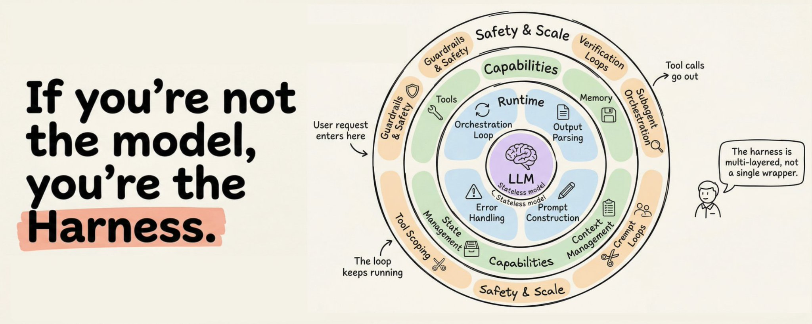
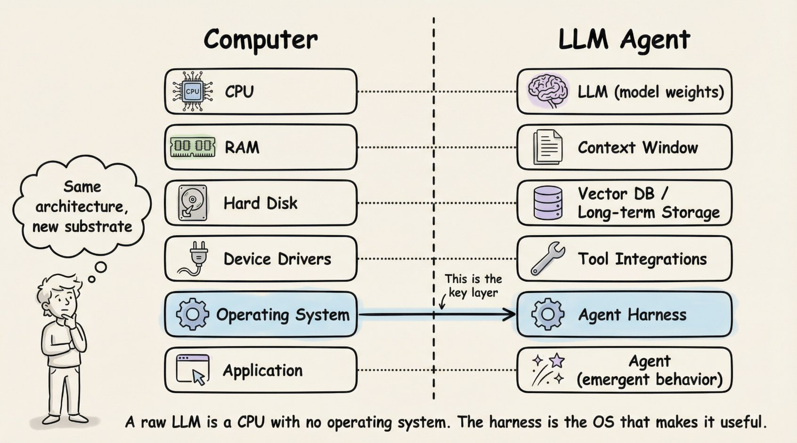
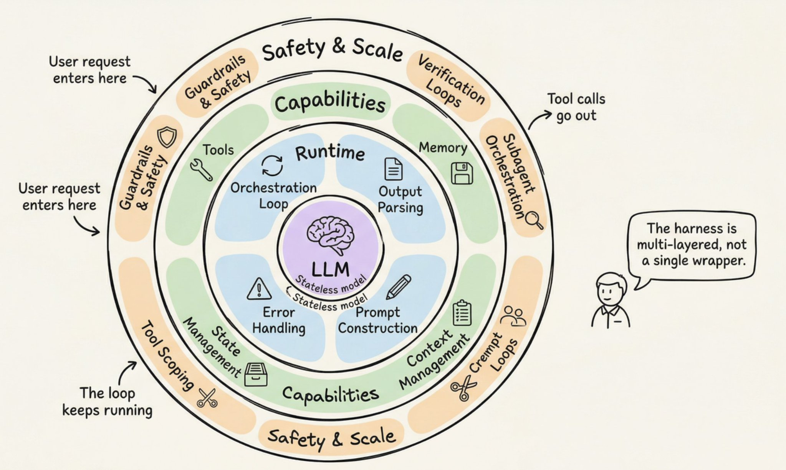
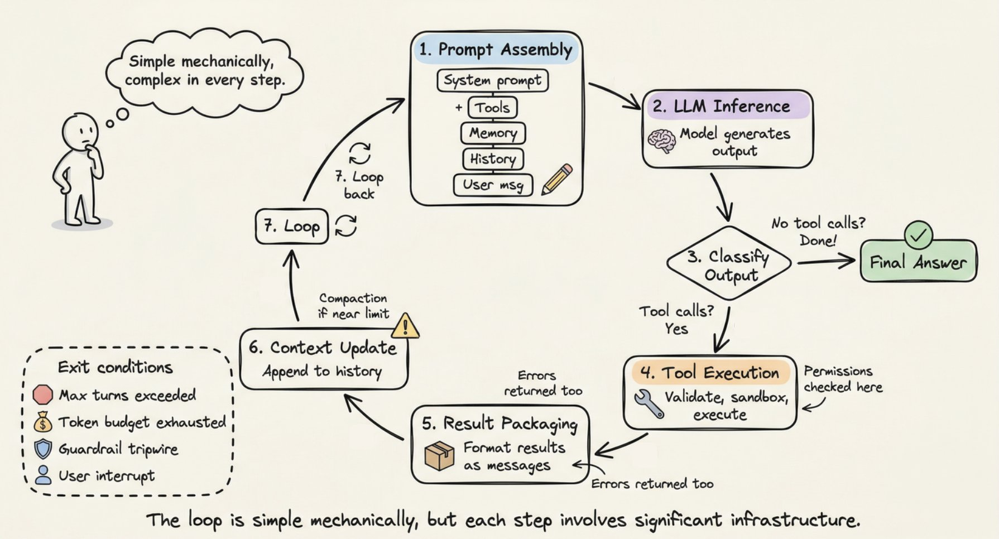
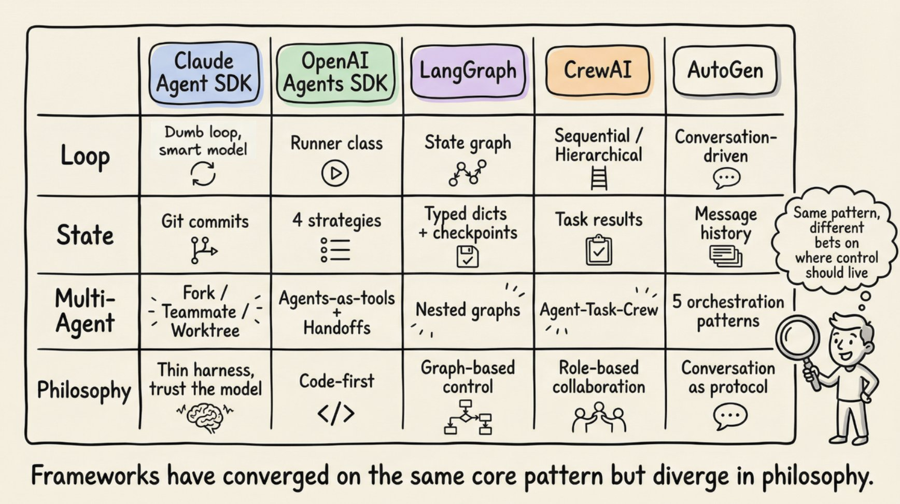
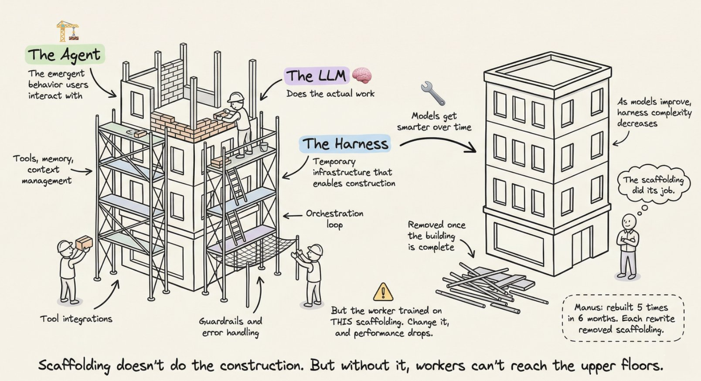
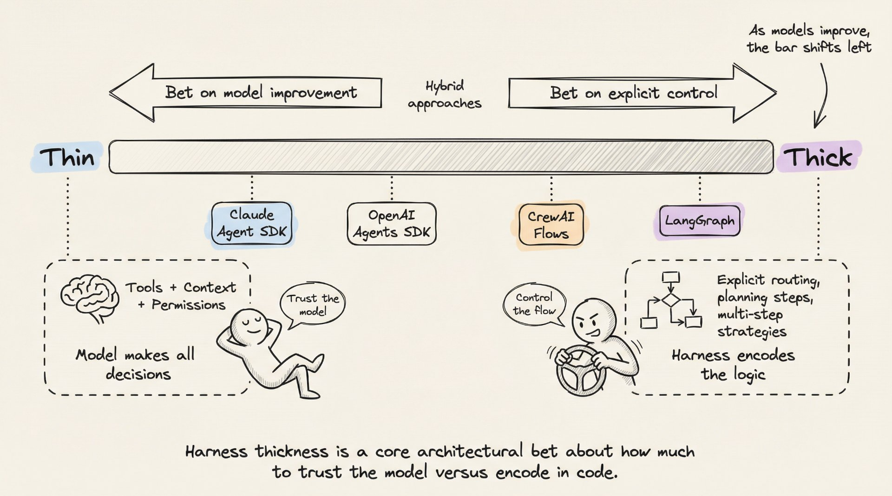
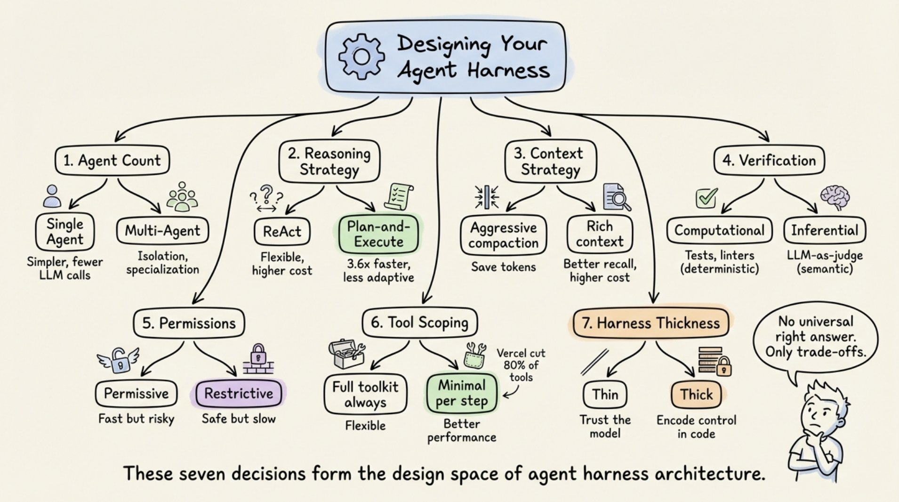

# The Anatomy of an Agent Harness

**Author:** Akshay (@akshay_pachaar)
**Source:** https://x.com/akshay_pachaar/status/2041146899319971922

A deep dive into what makes an LLM agent actually work — the orchestration loop, tools, memory, context management, and everything else that transforms a raw LLM into a useful agent. Covering patterns from Anthropic, OpenAI, LangChain, CrewAI, and AutoGen.

---

## If You're Not the Model, You're the Harness

The harness is multi-layered, not a single wrapper. It consists of concentric rings around the LLM, each with distinct responsibilities.

At the **center** sits the **LLM** — the stateless model. It does not remember between calls. Everything around it is the harness.

**Ring 1: Runtime** — the innermost infrastructure layer surrounding the LLM:

- **Orchestration Loop** — the core cycle that drives agent behavior; the loop keeps running until exit conditions are met
- **Prompt Construction** — assembles the prompt sent to the LLM each turn
- **Output Parsing** — parses and classifies LLM output (text vs tool calls)
- **Error Handling** — catches failures, retries, and recovers gracefully

**Ring 2: Capabilities** — the functional powers the harness provides:

- **Tools** — external capabilities the agent can invoke
- **Memory** — persistence across turns and sessions
- **Context Management** — controls what fits in the context window
- **State Management** — tracks conversation and task state

**Ring 3: Safety & Scale** — the outer protective and scaling layer:

- **Guardrails & Safety** — input/output filtering, safety checks
- **Verification Loops** — checking agent work for correctness
- **Subagent Orchestration** — managing multiple specialized agents
- **Tool Scoping** — limiting which tools are available when

User requests enter through the Safety & Scale layers. Tool calls go out through the same layers. The loop keeps running until exit conditions are met.

---

## The Computer Analogy: Harness as Operating System

A raw LLM is a CPU with no operating system. The harness is the OS that makes it useful. Same architecture, new substrate.

| Computer | LLM Agent |
|----------|-----------|
| CPU | LLM (model weights) |
| RAM | Context Window |
| Hard Disk | Vector DB / Long-term Storage |
| Device Drivers | Tool Integrations |
| **Operating System** | **Agent Harness** — this is the key layer |
| Application | Agent (emergent behavior) |

The harness sits between the raw capability (LLM) and the useful application (Agent), just as an OS sits between hardware and software.

---

## Detailed Harness Architecture

An expanded view of the concentric ring model reveals all the components and how they interact.

**LLM (center):** The stateless model. Capabilities emerge from the harness, not the model.

**Runtime layer:** Orchestration Loop, Prompt Construction, Output Parsing, Error Handling.

**Capabilities layer:** Tools, Memory, Context Management, State Management.

**Safety & Scale layer:** Guardrails & Safety, Verification Loops, Subagent Orchestration, Tool Scoping.

Two entry/exit points define how data flows:

- **User request enters** through guardrails before reaching the LLM
- **Tool calls go out** through guardrails before executing externally
- The loop runs continuously between these boundaries

The harness is multi-layered, not a single wrapper.

---

## The Agent Loop: Simple Mechanically, Complex in Every Step

The loop is simple mechanically, but each step involves significant infrastructure.

The agent loop follows a 7-step cycle:

1. **Prompt Assembly** — System prompt + Tools + Memory + History + User message are composed into the prompt
2. **LLM Inference** — Model generates output
3. **Classify Output** — Is it a tool call? If no tool calls, produce the **Final Answer** (done). If tool calls are detected, continue to step 4
4. **Tool Execution** — Permissions checked here. Validate, sandbox, and execute the tool call
5. **Result Packaging** — Format results as messages. Errors are returned too
6. **Context Update** — Append to history. Compaction of near-full context happens here
7. **Loop back** — Return to step 1

**Exit conditions:**

- Max turns exceeded
- Token budget exhausted
- Guardrail triggers
- User interrupt

---

## Framework Comparison: Same Pattern, Different Bets

Frameworks have converged on the same core pattern but diverge in philosophy. Same pattern, different bets on where control should live.

| Dimension | Claude Agent SDK | OpenAI Agents SDK | LangGraph | CrewAI | AutoGen |
|-----------|-----------------|-------------------|-----------|--------|---------|
| **Loop** | Dumb loop, smart model | Runner class | State graph | Sequential / Hierarchical | Conversation-driven |
| **State** | Git commits | 4 strategies | Typed dicts + checkpoints | Task results | Message history |
| **Multi-Agent** | Teamwork / Worktree | Agents-as-tools / Handoffs | Nested graphs | Agent-Task-Crew | 5 orchestration patterns |
| **Philosophy** | Thin harness, trust the model | Code-first | Graph-based control | Role-based collaboration | Conversation as protocol |

---

## The Scaffolding Metaphor

Agent systems have three key elements, and a construction metaphor captures their relationship precisely.

- **The Agent** — the emergent behavior users interact with
- **The LLM** — does the actual work (the construction worker). Models get smarter over time.
- **The Harness** — temporary infrastructure that enables construction (the scaffolding): tools, memory, context, orchestration loop, guardrails and error handling, tool integrations

Scaffolding doesn't do the construction. But without it, workers can't reach the upper floors.

The harness is removed once the building is complete — as models improve, harness complexity decreases. The scaffolding did its job.

But the worker was trained on THIS scaffolding. Change it, and performance drops. Models get retrained repeatedly, each time requiring removal and reconstruction of scaffolding.

---

## Thin vs Thick: The Harness Spectrum

Harness thickness is a core architectural bet about how much to trust the model versus encode in code.

**Thin end (bet on model improvement):**

- **Claude Agent SDK** — Tools + Content + Permissions. Model makes all decisions. Trust the model.
- **OpenAI Agents SDK** — Similar thin philosophy.

**Middle:** Hybrid approaches that balance model autonomy with explicit control.

**Thick end (bet on explicit control):**

- **CrewAI Flows** — Control the flow explicitly through role-based orchestration.
- **LangGraph** — Explicit routing, planning steps, multi-agent strategies. The harness encodes the logic.

As models improve, the bar shifts left toward thinner harnesses. The trend favors trusting the model more over time.

---

## Designing Your Agent Harness: Seven Key Decisions

These seven decisions form the design space of agent harness architecture. There is no universal right answer — only trade-offs.

1. **Agent Count**
   - Single Agent: Simpler, fewer LLM calls
   - Multi-Agent: Isolation, specialization

2. **Reasoning Strategy**
   - ReAct: Flexible, higher cost
   - Plan-and-Execute: 3.6x faster, less adaptive

3. **Context Strategy**
   - Aggressive compaction: Save tokens
   - Rich context: Better results

4. **Verification**
   - Computational: Tests, linters (deterministic)
   - Inferential: LLM-as-judge (semantic)

5. **Permissions**
   - Permissive: Fast but risky
   - Restrictive: Safe but slow

6. **Tool Scoping**
   - Full toolkit always: Flexible
   - Minimal per step: Better performance. Vercel uses 80% fewer tools

7. **Harness Thickness**
   - Thin: Trust the model
   - Thick: Encode control in code
