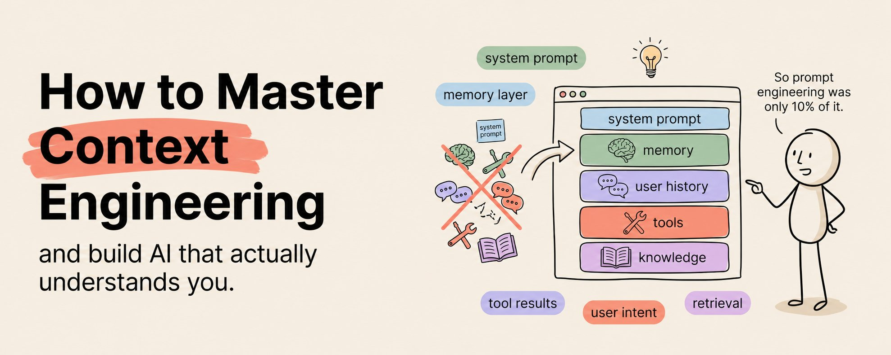

# How to Master Context Engineering & Build AI Systems That Actually Understand You (Full Course)

Most people think the secret to getting better results from AI is writing better prompts.

They spend hours crafting the perfect sentence. They add "act as a senior expert." They throw in "think step by step." They tweak one word, run it again, tweak another word, run it again.

And the results barely change.

Here is why.

**Prompt engineering is the syntax. Context engineering is the infrastructure. And infrastructure beats syntax every single time.**

The people building AI systems that actually work, systems that remember your preferences, access your data, follow your rules consistently, and produce reliable outputs day after day, are not writing better prompts.

They are engineering better context.

Context engineering is the practice of designing, structuring, and managing the exact information an AI model has access to when it generates a response. It is everything surrounding the prompt. The files it can read. The memory it carries from previous sessions. The tools it can use. The constraints that shape its behavior. The examples that calibrate its output.

A perfectly worded prompt inside a poorly designed context will produce average results every time.

A basic prompt inside a perfectly designed context will produce exceptional results every time.

That is the shift most people are completely missing.

This article is the complete course. Six weeks. From understanding what context engineering actually is to building production-grade AI systems that outperform anything you have ever gotten from a chat window.

## Week 1: Understand Why Prompts Alone Will Never Be Enough

### The Problem With Prompt-Only Thinking

When you type a message into Claude, the model does not just see your message. It sees everything in the context window. The system prompt, any uploaded documents, the conversation history, tool definitions, and your latest message, all of it, processed together.

Your prompt is one ingredient. Context is the entire kitchen.

Most people obsess over the ingredient and completely ignore the kitchen. They write a beautiful prompt and paste it into a blank conversation with zero context. Then they wonder why the output feels generic.

It feels generic because the model has nothing to personalize with. It has no knowledge of your work, your audience, your standards, your previous decisions, or your goals. It is working blind. And a blind model defaults to the most average, most generic, most safe response it can produce.

Context engineering fixes this by giving the model eyes.

### The Three Layers of Context

Every AI interaction has three context layers, and most people are only using one.

**Layer one is the immediate context.** This is your prompt. The question you ask, the instructions you give, the format you request. This is where 99% of people stop.

**Layer two is the session context.** This is everything the model knows within a single conversation. Uploaded files, conversation history, system instructions. Most people use this partially but do not design it intentionally.

**Layer three is the persistent context.** This is knowledge that carries across sessions. Memory systems, context files, knowledge bases, saved preferences. Almost nobody uses this properly, and it is where the biggest leverage lives.

## Week 2: Design Your Context Architecture

### Stop Treating Every Session Like the First One

The single biggest productivity leak in AI-assisted work is re-explaining yourself every session.

Every time you open a new conversation and type "I am a marketing consultant who works with SaaS startups in the B2B space, my audience is founders and CMOs, I write in a direct conversational tone..." you are wasting two minutes and getting slightly different results every time because you phrase it slightly differently each time.

Context architecture solves this permanently.

You build it once. You refine it over time. And every session starts with the model already knowing everything it needs to know.

### The Four Files Every Professional Needs

**Your identity file.** Who you are, what you do, your expertise, your background, your communication style. This is the "onboarding document" for your AI.

**Your audience file.** Who you are creating for. Their demographics, psychographics, knowledge level, pain points, goals, and the language they use. This ensures every output is targeted, not generic.

**Your standards file.** What good looks like. Your quality criteria, your formatting preferences, your tone guidelines, your anti-patterns, your examples of excellent work and terrible work. This is your quality control system.

**Your project file.** What you are working on right now. Current goals, active projects, recent decisions, open questions, deadlines. This is the dynamic layer that changes weekly or monthly.

Load these four files at the start of every session and the model transforms from a generic assistant into a contextually aware collaborator that already understands your world.

## Week 3: Master Dynamic Context Loading

### Not Every Task Needs the Same Context

Loading your entire knowledge base into every conversation is a waste of tokens and actually degrades performance. When the context window is flooded with irrelevant information, the model's attention gets diluted. It tries to use everything and ends up using nothing effectively.

Dynamic context loading means giving the model exactly the right information for the specific task at hand. Not everything you know. Just what matters right now.

Think about how a human expert works. A surgeon does not review every medical textbook before every operation. They review the specific patient file, the specific procedure notes, and the specific imaging results. They load the relevant context, not all context.

Your AI systems should work the same way.

### How to Design Context Loading Rules

For every recurring type of work, define which context files get loaded.

**Writing tasks** load your identity file, audience file, and standards file plus examples of your best performing content in that format.

**Analysis tasks** load your identity file and project file plus the raw data and any previous analysis on the same topic.

**Research tasks** load your project file plus your research methodology document plus any existing research you want the model to build on.

**Strategy tasks** load all four files plus your competitive landscape document plus relevant industry data.

By pre-defining these loading rules, every session starts with the exact right context loaded. No more guessing. No more over-loading. No more under-loading.

## Week 4: Build Memory Systems That Persist Across Sessions

### The Memory Problem Is Not a Bug. It Is a Feature You Are Not Using.

Every conversation with Claude starts fresh. The model does not remember what you discussed yesterday, last week, or last month.

Most people treat this as a limitation. The smartest people treat it as a design opportunity.

When you build a memory system, you control exactly what the model remembers. You curate the context. You remove outdated information. You add new learnings. You shape the model's knowledge base deliberately rather than letting it accumulate randomly.

A human employee remembers everything, including their bad habits, their outdated assumptions, and their incorrect interpretations. An AI with a designed memory system remembers only what you want it to remember, updated to reflect your latest thinking.

### Three Approaches to AI Memory

**Manual memory documents.** The simplest approach. You maintain a running document that captures key decisions, learnings, preferences, and project history. At the start of each session, you paste the relevant portions into the conversation. This works for individuals and small-scale work.

**Structured knowledge bases.** The intermediate approach. You build an organized system of markdown files in a folder structure. Obsidian is ideal for this. You categorize information by project, topic, or domain. When you need specific context, you load the specific files. Claude Code can read these files directly from your filesystem.

**Vector databases and RAG.** The advanced approach. You embed your documents into a vector database and build a retrieval system that automatically finds and loads the most relevant context for any given query. This scales to thousands of documents and is what production AI systems use.

Start with manual memory documents. Graduate to structured knowledge bases when you have more than 20 context documents. Move to vector databases when your knowledge base exceeds what you can manage manually.

## Week 5: Connect Context to Tools With MCP

### Context Without Tools Is Knowledge Without Hands

You can give an AI model perfect context about your business. It can know your audience, your standards, your projects, and your entire history of decisions.

But if it cannot access your data, query your databases, search the web, read your emails, or interact with your tools, it is still just a very well-informed text generator.

**MCP, Model Context Protocol, is what gives your context-rich AI model the ability to act on what it knows.**

When you combine deep context with MCP tool access, the model stops being an advisor and starts being an operator. It does not just know what your weekly report should contain. It pulls the data, runs the numbers, formats the report, and saves it to your drive.

### The Context-MCP Integration Pattern

The pattern that produces the best results is **context-first, tools-second**.

Your system prompt establishes the context. Who the model is, what it knows, what standards it follows, what its current priorities are.

Your MCP servers provide the capabilities. Web search, file access, database queries, API integrations, email access, calendar access.

Your task prompt brings them together. "Based on what you know about our Q2 goals and our competitor landscape, pull the latest market data, compare it against our internal metrics, and produce a weekly strategy brief."

The context tells the model why and what. The tools tell the model how. The task tells the model when and where.

## Week 6: Build Production Systems and Scale

### From Personal Productivity to Professional Infrastructure

Everything you have built over the last five weeks is a personal context engineering system. It makes you individually faster, more consistent, and more effective with AI.

The next level is building context-engineered systems for others.

Businesses need AI systems that understand their specific domain, follow their specific rules, access their specific data, and produce outputs that match their specific standards. That is context engineering packaged as a product or service.

The person who can walk into a company, audit their AI workflows, design a context architecture, implement memory systems, connect MCP tools, and deliver a production-grade AI system is the person companies are paying $5,000 to $25,000 per project right now.

The demand for this skill is growing faster than the supply. And it will keep growing for years because context engineering is not a trend. It is the fundamental infrastructure layer that makes every AI application work better.

## The Shift That Changes Everything

Most people will continue writing better prompts.

They will keep searching for the magic words. They will keep tweaking sentences. They will keep getting incremental improvements while wondering why other people are getting transformational results.

The difference is not the prompt.

The difference is the context surrounding the prompt.

Engineer the context. Design the architecture. Build the memory. Connect the tools. Structure the information. Shape the environment.

Do that and every prompt you write will produce results that prompt-only thinkers cannot replicate no matter how perfectly they word their requests.

Prompt engineering is the skill of 2024.

Context engineering is the skill of 2026 and beyond.
