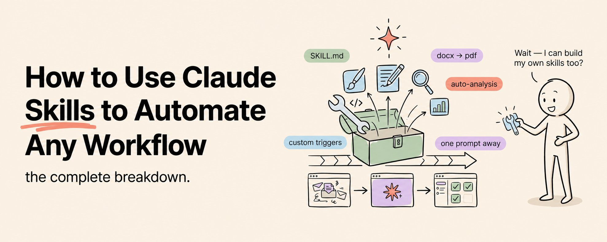

# How to Use Claude Skills to Automate Any Workflow (Full Course)

I have combined everything I know about Claude Skills into one article.

Bookmark & Save this :)

After reading this you will understand Claude Skills better than 99 percent of users. You will have built and deployed at least one custom skill. And you will have a repeatable system for automating any workflow in any industry.

That is not hyperbole. This is the complete playbook.

## What Claude Skills Actually Are (And Why Most People Are Using Them Wrong)

A Claude Skill is a permanent instruction file that lives on your computer and tells Claude exactly how to perform a specific task. Every single time. Without you re-explaining it.

Most people hear that and think "oh, so it is like a saved prompt."

No. A saved prompt is a starting point for a conversation. A Skill is a trained employee.

A saved prompt says "here is how to start." A Skill says "here is exactly how to do this job from start to finish, here is what good output looks like, here is what to do when things go wrong, here are the tools you need, and here is the format to deliver results in."

The difference in output quality is enormous.

When you give Claude a one-off prompt, you get one-off quality. Inconsistent. Sometimes great, sometimes mediocre. Different every time because you phrase things slightly differently every time.

When you activate a Skill, you get standardized quality. The same process, the same standards, the same output format, every single time. That is the difference between having an intern and having a trained professional.

### Why Skills Are the Most Underleveraged Feature in AI Right Now

There are over 80,000 community Skills available right now. The marketplace is growing by thousands every week. Anthropic has published official Skills for PDFs, Word docs, presentations, spreadsheets, and design.

And most people have never installed a single one.

The reason is simple. Nobody has explained how to use them properly. Most guides show you how to install a Skill and stop there. That is like showing someone how to hire an employee and never teaching them how to manage one.

This article covers the full lifecycle. How to find the right Skills. How to install them. How to build custom ones from scratch. How to test and refine them. How to deploy them into real workflows. And how to build a complete library of Skills that automates your entire operation.

## Phase 1: Install Your First Skill in Five Minutes

### Where Skills Live

Skills are just folders on your computer. Inside each folder is a file called SKILL.md. That file contains the instructions that tell Claude how to do the job.

For Claude Code they live in your project directory at `.claude/skills/` or globally at `~/.claude/skills/`.

For Claude Desktop with Cowork they work through the desktop interface.

That is it. No complex installation. No dependencies. No configuration files. A folder with a text file.

### What to Do in Phase 1

- Browse skillsmp.com or github.com/anthropics/skills and find a Skill relevant to your work
- Install it following the instructions in the repository
- Run it on a real task you normally do manually
- Compare the output quality and speed to your usual prompting approach
- If the output is not perfect, note what needs improvement

## Phase 2: Build Your First Custom Skill From Scratch

### The Three-Question Test

Before you build, answer three questions.

**What does this Skill do?** Be brutally specific. Not "help with emails." Instead: "Draft professional follow-up emails to prospects who attended our webinar, reference the specific session they attended, include one relevant case study, and end with a clear call to action for a 15-minute demo call."

**When should it activate?** What would you actually type to trigger it? "Write a follow-up email." "Draft a webinar follow-up." "Create a prospect email." List at least five trigger phrases.

**What does perfect output look like?** Do not describe it abstractly. Show an actual example. Paste in a real email you wrote that was excellent. That example is worth more than 50 lines of instructions.

### Write the SKILL.md

Your SKILL.md file has two sections.

The YAML frontmatter at the top between `---` markers. This contains the name in kebab-case and the description, an aggressive, specific paragraph listing every trigger phrase and clearly stating when the Skill should and should not activate.

The instructions below the frontmatter. This is your workflow written in plain English. Step by step. Sequential. Each step is one clear action. Include examples of input and output. Include edge cases and how to handle them. Include your quality standards.

Keep the entire file under 500 lines. Vague language like "format nicely" or "handle appropriately" is banned. Every instruction must be specific and testable.

### What to Do in Phase 2

- Pick the task you repeat most often and answer the three-question test
- Write the YAML frontmatter with aggressive trigger descriptions
- Write the instructions as a step-by-step workflow with concrete examples
- Save the SKILL.md file in the correct Skills directory
- Run the Skill on a real task and save the output for review

## Phase 3: Test, Refine, and Make It Production-Grade

### The Three-Scenario Test

Run your Skill against three scenarios.

**The happy path.** A normal, straightforward input that represents 80 percent of your use cases.

**The edge case.** A weird, unusual, or incomplete input that tests the boundaries. Missing data. Unusual formatting. Conflicting information.

**The stress test.** The biggest, messiest, most complex version of the task. This reveals whether your Skill scales or whether it only works on simple inputs.

If your Skill passes all three scenarios with output you would be comfortable showing to a client, it is production-grade. If it fails any scenario, the failure tells you exactly what instruction to add.

### The Weekly Refinement Cycle

Every time you use a Skill and the output is not quite right, update the SKILL.md immediately. After one month of refinement, your Skill will produce output that is indistinguishable from work done by a trained human professional.

### What to Do in Phase 3

- Run your Skill against the three scenarios: happy path, edge case, stress test
- For each failure, add the specific instruction or example that would have fixed it
- Run all three scenarios again and confirm the fixes work
- Set a calendar reminder to review and refine your Skill every Friday for the first month

## Phase 4: Build a Complete Skill Library for Your Industry

### One Skill Is a Tool. Ten Skills Is a Workforce.

Build a Skill for every recurring task in your workflow. Content creation Skill. Research Skill. Email drafting Skill. Data analysis Skill. Meeting prep Skill. Report generation Skill. Client communication Skill. Competitive analysis Skill.

Within a month you can have ten production-grade Skills running. Within three months you can have a complete library covering every major workflow in your role.

### Industry-Specific Skill Ideas

**For real estate:** Property listing writer. Market analysis generator. Client follow-up drafter. Comparable sales researcher. Open house prep briefer.

**For marketing:** Campaign brief generator. Ad copy writer. Analytics report compiler. Content calendar planner. A/B test analyzer.

**For finance:** Expense report processor. Invoice analyzer. Budget variance explainer. Client portfolio summarizer. Regulatory compliance checker.

**For consulting:** Proposal drafter. Discovery call prepper. Deliverable formatter. Status report generator. Engagement summary writer.

**For e-commerce:** Product description writer. Customer review analyzer. Inventory report generator. Competitor pricing tracker. Return analysis compiler.

The pattern is universal. Identify the tasks. Build the Skills. Refine them. Let Claude handle the execution while you handle the strategy.

### What to Do in Phase 4

- List every recurring task in your current workflow
- Prioritize them by frequency and time consumed
- Build one new Skill per week starting with the highest-priority task
- Maintain a master document tracking all your Skills, their status, and their last refinement date
- Share your best Skills publicly

## The Bottom Line

One Skill that saves 30 minutes per week saves 26 hours per year. Ten Skills saving 30 minutes each saves 260 hours per year. That is six and a half full work weeks returned to you annually.

Most people will keep typing the same instructions into Claude every single day.

The ones who build a Skill library will be running a completely different operation within 60 days.
