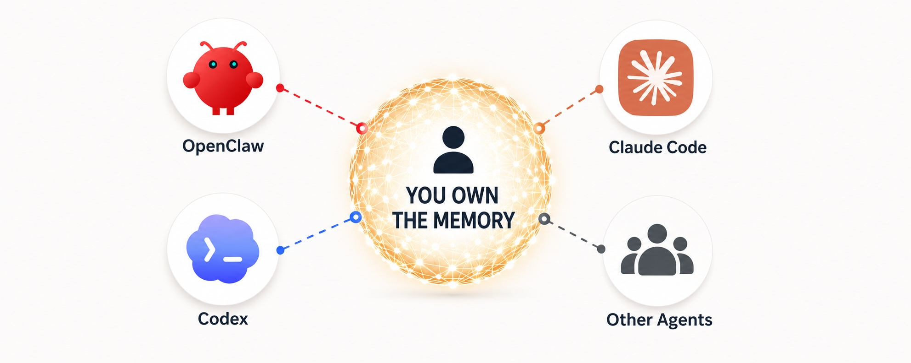

# Stop Giving Every Agent Its Own Skull

We are building agents to feel like people. That is useful in some ways, but we are also copying one of the biggest limitations of being human.

Meet someone new and they know nothing about you. You need to explain things like your interests, your backstory and goals. Then you do it again with the next person, and again with the next.

This is the tax of being human: knowledge lives in skulls, and skulls do not sync.

We have paid that tax our whole lives, so we barely notice it. It's just how humans work. But now we are rebuilding it inside software systems that do not need to be so isolated.

Each agent is like its own little brain with its own memory. It gets its own partial view of you and your work. If you zoom out and look across the whole suite of agents you are using you'll find that the whole system and the picture of you feels fragmented.

## My Agents Are Strangers

I notice this most in my own workflow because I use several agents on purpose.

OpenClaw is my personal assistant. It knows the most about my life: family, schedule, meetings, projects, preferences, and the rhythm of what is going on day to day. It is also where I develop ideas. I talk something through, argue with it, find the shape of the idea, abandon a few branches, resurrect one, and only then move to execution.

So OpenClaw ends up with the richest context on both me and my ideas.

Codex is where I build. Once an idea is ready, I move there. But the reasoning that produced the idea usually stayed behind in OpenClaw. Codex sees the repo, and a plan. But it does not see the conversation that birthed the plan.

Claude Code is where I go for design and writing. I might build something in Codex, then ask Claude Code to help with a landing page, demo script, or drafting a blog post. The handoff is not terrible as I can point it to the same repo folder on disk. But the reasoning behind the work is still back on OpenClaw: the audience, the tradeoffs, the rejected approaches, the emotional tone of the thing.

The output can be competent and context-blind at the same time.

There is a physical layer too. OpenClaw runs on my Mac Mini. Codex and Claude Code run on my MacBook Pro. Other agents may live partly or entirely in the cloud. Different machines. Different filesystems. Different local state. The repo can sync through GitHub, but the project's memory does not.

The islands are not just conceptual. They are literal.

Each agent re-derives what I have already explained. Each is oblivious to what the agent next door figured out an hour ago.

## The Repo Is Not the Memory

The obvious objection is: just write things down.

Use markdown. Keep plans in the repo. Store decisions in docs. Write summaries. Have every agent read the same files.

This helps but it only captures the destination, not the journey.

The real value is often in the session itself: the sparring, the false starts, the branches you explored and set aside. When you commit a plan to paper, you compress the conversation. You keep the conclusion and throw away most of the path.

Then, days later, the path matters again.

I will go back to OpenClaw and say, "Remember that thing we talked about? Actually, let's do it that other way."

What I am really doing is re-entering the idea tree and retrieving a branch I had pruned. That branch never made it into the markdown file because, at the time, it seemed dead.

A synced repo cannot solve that. The repo has artifacts. The agent session has context. The written plan is the tip of the iceberg. The conversation is the rest of it.

That does not mean dumping every transcript everywhere. A lot of conversation is noise. Some of it is sensitive. Some of it is wrong. Some should expire. Some should stay local to a project or role.

The useful unit is the thing worth keeping.

When an agent learns one of those things, it should not be trapped inside the agent where it happened.

## The Hive Mind Is the Point

For humans, knowledge moves slowly. It has to be spoken, written, taught, misunderstood, clarified, retold. Even inside a company, the same fact travels through meetings, memos, Slack threads, and one-on-ones like a rumor trying to become infrastructure.

Agents do not have that limitation.

If one of them learns something useful, the others can know it too. Right away, if the memory layer is built that way.

That starts to feel less like better notes and more like a hive mind.

Imagine an AI version of a company leader sitting in ten meetings at once.

In one meeting, it learns that a major customer is confused about pricing. In another, the product team is debating whether pricing is clear enough. In a third, sales is trying to explain why a deal stalled.

In the human version, those dots might take days or weeks to connect. Maybe they never connect at all. The customer complaint becomes a support note. The product debate becomes a roadmap item. The sales issue becomes a pipeline problem.

In the agent version, the collision can happen while the meetings are still happening.

The knowledge is not trapped in the room where it was learned.

The personal version is smaller, but it has the same shape.

A design decision made while coding can improve the launch copy five minutes later. A preference corrected in a personal assistant can change the default in a coding agent. A half-formed idea from last week can resurface when the right project appears.

The system stops behaving like a set of assistants and starts behaving like one distributed mind with different hands.

## The Missing Layer

Real work does not respect tool boundaries.

A project can start as a personal note, become a product decision, turn into code, need design, launch writing, support, and follow-up. That is why I use multiple agents as specialization is useful.

The gap is obvious once you feel it: the tools are getting more capable, but the memory underneath them is still fragmented. And the fragmentation gets worse as agents spread across apps, machines, cloud services, and local environments.

This feels like one of the important areas for development over the next year.

You can already see promising projects attacking different parts of it.

[@garrytan](https://x.com/garrytan)'s [GBrain](https://github.com/garrytan/gbrain/) points toward a shared knowledge graph behind MCP: point it at different data sources and the knowledge graph grows and different agents can query it instead of each keeping its own private memory.

[@doodlestein](https://x.com/doodlestein)'s [CASS](https://github.com/Dicklesworthstone/coding_agent_session_search) tackles the part that markdown and repos miss: the session history itself. It makes local agent sessions searchable across Codex, Claude Code, OpenClaw, Cursor, Aider, and more, which matters because the session often contains the reasoning the repo left behind.

These projects are signals that the problem is real, and that important pieces of the answer are starting to come into view.

Many agents with one memory layer underneath them, owned by you.
