# Zero to AI Engineer - The Roadmap


## The $300/month Mistake

Six months ago I was paying $49/month for Coursera Plus, $39/month for DataCamp, and had dropped $199 on two Udemy bundles. I was collecting certificates like Pokémon cards and couldn't build a single thing from scratch.

Then I found something that changed everything: the companies that actually *build* AI - Google, Anthropic, OpenAI - had started giving away their training for free. Not watered-down intro videos. Full courses with certificates. Meanwhile, GitHub had repositories with 95,000+ stars that taught better than any course I'd paid for.

I cancelled every subscription. Built an AI agent that manages my morning routine. And I did it all for $0.

This article is the exact system I wish I had when I started. Not a list of links. Not "30 resources you'll never open." This is a step-by-step path: do this first, then this, then build this. Follow it in order. In 14 weeks, you'll go from zero to deploying real AI systems.

## How to Use This Guide

**Rule 1: Don't skip ahead.** Step 3 assumes you've done Step 2. If you jump to LLMs without understanding gradients, you'll be copying code you don't understand.

**Rule 2: Take notes.** I use Obsidian (free, local, markdown). After every session, write down three things: what you learned, what surprised you, what's still unclear. This is non-negotiable.

**Rule 3: Build at every step.** Each step ends with a checkpoint. If you can't do it, go back.

### Set up this folder structure in Obsidian before you start:

```
AI-Learning/
├── 00-setup/
│   └── accounts-and-tools.md
├── 01-fundamentals/
│   ├── notes.md
│   └── key-concepts.md
├── 02-ml-foundations/
│   ├── notes.md
│   └── projects/
├── 03-deep-learning/
│   ├── notes.md
│   └── karpathy-exercises/
├── 04-llms-and-prompting/
│   ├── notes.md
│   └── projects/
├── 05-agents/
│   ├── notes.md
│   └── my-agent/
├── 06-production/
│   ├── deploy-notes.md
│   └── eval-results/
├── 07-portfolio/
│   ├── github-readme-draft.md
│   └── linkedin-cases.md
└── resources.md
```

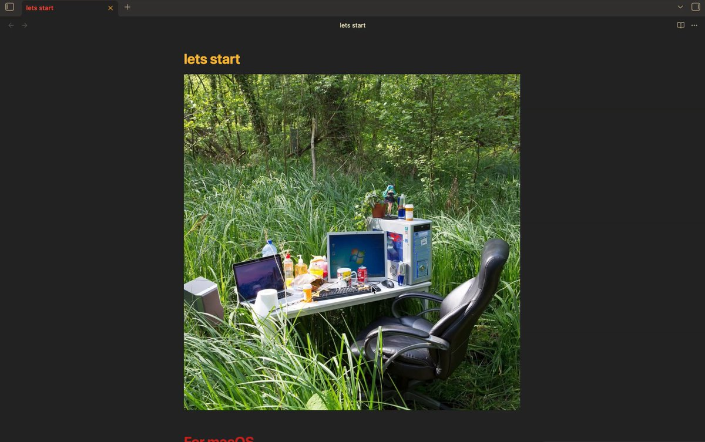

## Step 1: Set Up Your Environment (Day 1)

Before you learn anything, set up your tools. One evening. Don't overthink it.

### Install Your Tools

1. **Python 3.11+** - python.org/downloads. Check "Add to PATH."
2. **VS Code** - code.visualstudio.com. Install Python extension.
3. **Git + GitHub** - github.com. For forking repos and saving projects.
4. **Obsidian** - obsidian.md. Create the folder structure above.
5. **Ollama** - ollama.com. For running models locally. Install now, you'll use it from Step 4.

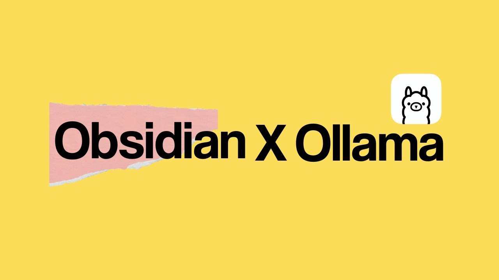

### Create Your Free Accounts

1. **Anthropic Academy** - anthropic.skilljar.com. 16 free courses with certificates. The most underrated AI learning platform in 2026.
2. **OpenAI Academy** - academy.openai.com. Free workshops, tutorials, AI Foundations course.
3. **Google AI** - grow.google/ai. Google AI Professional Certificate — 7 modules, free via Coursera audit.
4. **Coursera** - coursera.org. Audit mode = free. For IBM ML Certificate and Google courses.

**Audit Mode on Coursera:** When Coursera asks you to pay, look for the small "Audit this course" link at the bottom. Full access to all videos and materials, free. No Coursera cert, but you'll get certs directly from Anthropic, OpenAI, and Google instead.

### CHECKPOINT:

Python + VS Code + Ollama installed. GitHub account created. Obsidian vault ready. Accounts on Anthropic Academy, OpenAI Academy, Google AI, and Coursera.

## Step 2: AI Fundamentals - Understand What You're Building (Weeks 1–2)

**Why this matters in 2026:** AI literacy is now a hiring filter. A 2025 WEF analysis found AI-literate workers command 15–22% salary premiums. Understanding the fundamentals puts you ahead of 90% of applicants.

### Week 1: The Big Picture

**First → Google AI Professional Certificate (Modules 1–3)**

grow.google/ai-professional - Gentlest on-ramp. No code. Covers: what AI is, brainstorming with AI, research with AI. Gives you the vocabulary.

**Then → Anthropic Academy: AI Fluency: Framework & Foundations**

anthropic.skilljar.com - The 4D AI Fluency Framework. Co-developed with university professors. Takes 2–3 hours. This is one of the best intro courses available anywhere in 2026, and the certificate genuinely looks good on LinkedIn - it's from Anthropic, the company behind Claude.

### Week 2: First Code + First Concepts

**Then → microsoft/generative-ai-for-beginners (Lessons 1–6)**

github.com/microsoft/generative-ai-for-beginners - 95,000+ stars. 21 lessons. Fork this repo and work through lessons 1–6: what is GenAI, how LLMs work, using prompts, first chat app.

```
## Session: [Date] - [Topic]
### What I learned
- ...
### What surprised me
- ...
### Still unclear
- ...
### Key terms
- LLM: ...
- Transformer: ...
- Token: ...
```

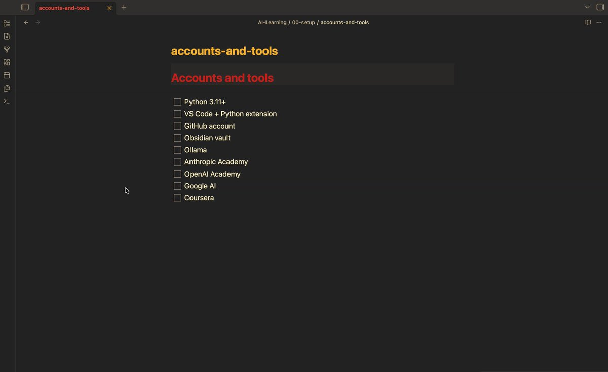

### CHECKPOINT:

You can explain LLMs, tokens, and transformers in your own words. First Jupyter notebooks run. Obsidian has 4–6 notes.

## Step 3: ML Foundations - Learn the Math Behind the Magic (Weeks 3–5)

**Why this matters in 2026:** ML fundamentals are the difference between someone who copies tutorials and someone who debugs models. Companies pay $150K+ for engineers who understand why a model underperforms, not just how to call an API.

**Primary: microsoft/ML-For-Beginners**

github.com/microsoft/ML-For-Beginners - 44,900+ stars. 12-week curriculum: regression, classification, clustering, NLP basics. Quizzes, notebooks, challenges. We compress to 3 weeks at 2 lessons/day.

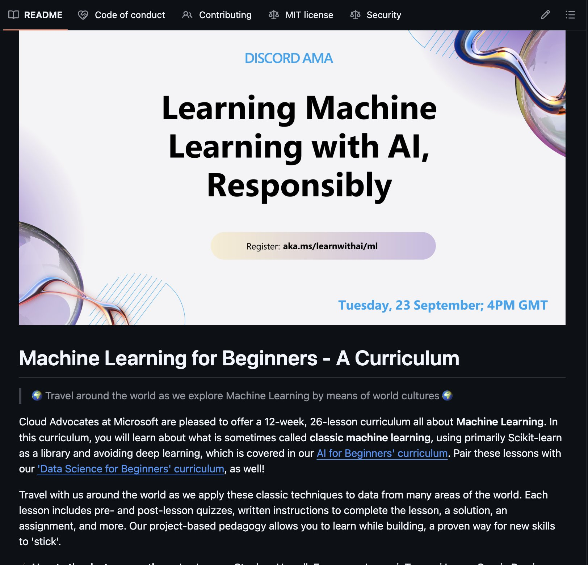

**Parallel: IBM Machine Learning on Coursera**

coursera.org/professional-certificates/ibm-machine-learning - Audit mode free. More traditional video format. Use alongside Microsoft repo — two angles on same topic = better retention.

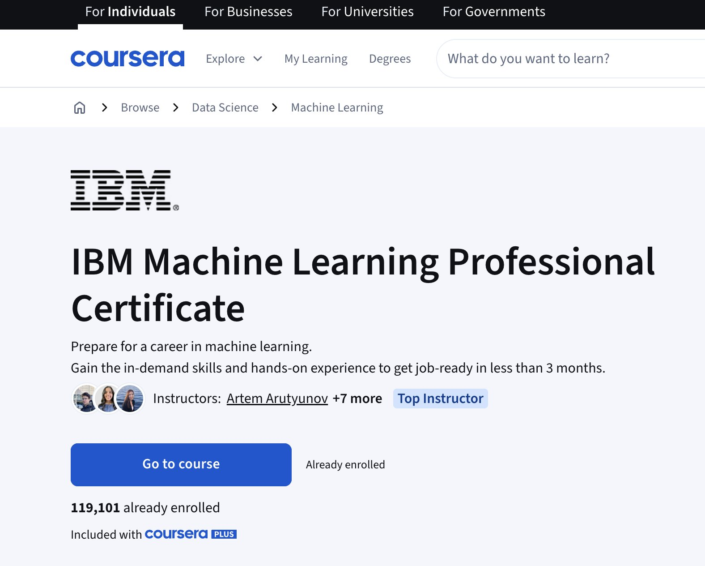

**Math Reference: mlabonne/llm-course (Foundations)**

github.com/mlabonne/llm-course — 40K+ stars. First section: linear algebra, calculus, probability. Only the math relevant to ML. Reference it whenever you hit something unfamiliar.

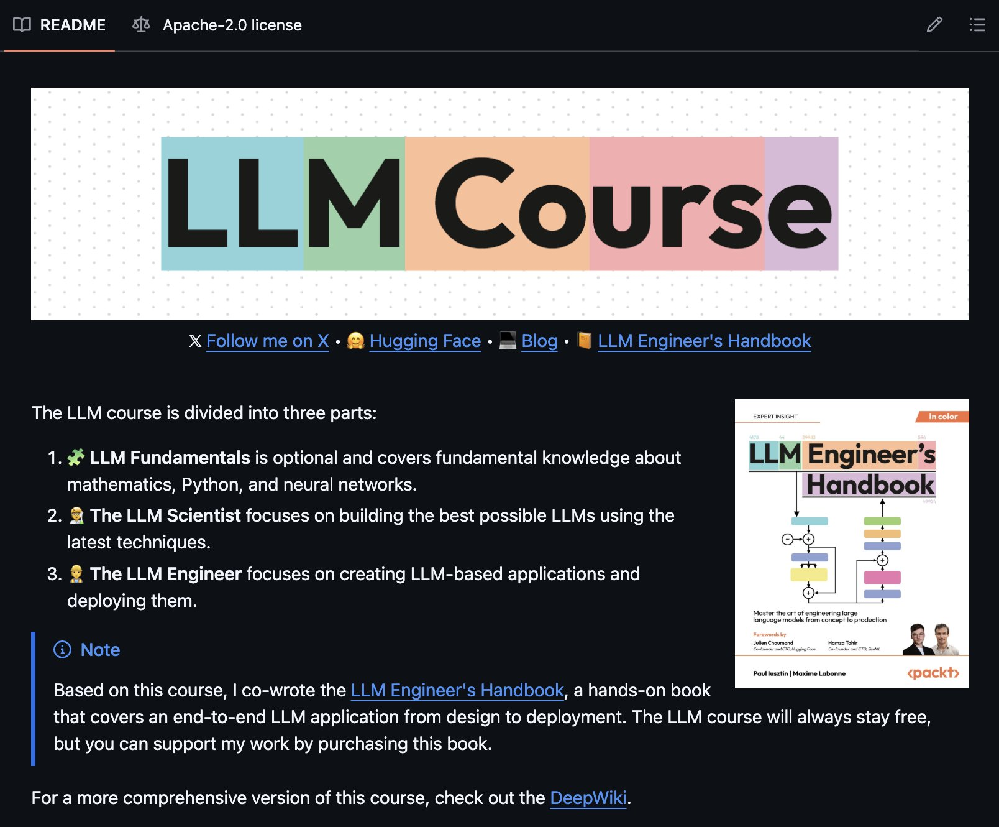

**Week 5 Project:** Pick a dataset from the Microsoft repo. Build your own classification model from scratch. Push to GitHub.

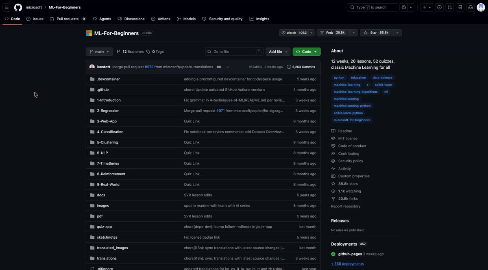

**CHECKPOINT:** You understand regression, classification, clustering, gradient descent, loss functions, overfitting. You've trained a model on real data. One project on GitHub.

## Step 4: Deep Learning & Neural Networks - Build From Scratch (Weeks 6–8)

**Primary: karpathy/nn-zero-to-hero**

karpathy.ai/zero-to-hero.html (videos) + github.com/karpathy/nn-zero-to-hero (code)

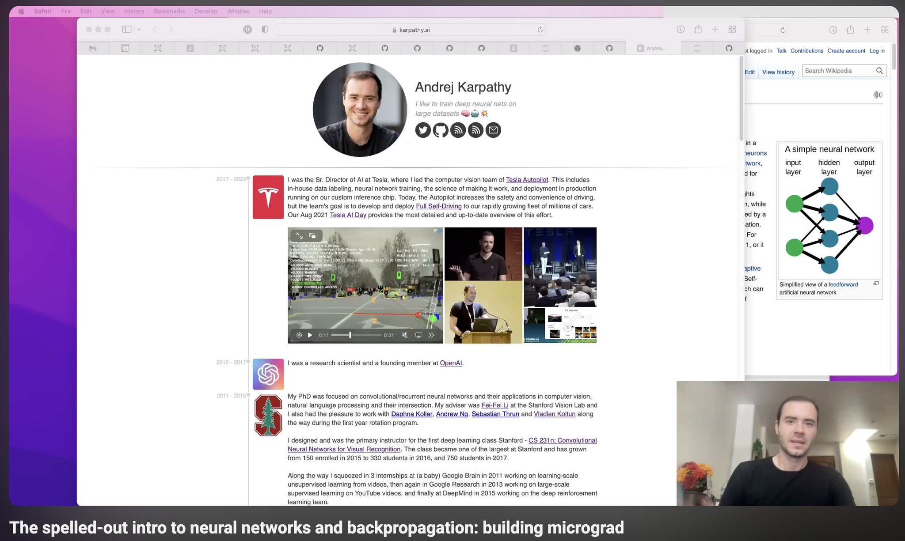

Andrej Karpathy, former Director of AI at Tesla, co-founder of OpenAI. He builds neural networks from absolute scratch - no frameworks, just Python and math. You build: micrograd, makemore, and nanoGPT.

1. **Week 6:** Lectures 1–3 (micrograd + makemore). Code along. Pause, type every line, run it, break it.
2. **Week 7:** Lectures 4–5 (activations, BatchNorm, backprop). Dense - one lecture per day. Detailed notes.
3. **Week 8:** Lectures 6–7 (GPT from scratch + tokenization). The payoff: you build a transformer.

**Parallel experiment with Ollama:** While you're building nanoGPT, run `ollama run llama3.2:3b` in another terminal. Compare your "toy" model's output with a real 3B-parameter model. This bridges the gap between "I understand the theory" and "I can run models locally." It's eye-opening to see what 3 billion parameters vs. your 10 million does to output quality.

**Supplement: microsoft/AI-For-Beginners (Deep Learning)**

github.com/microsoft/AI-For-Beginners - Weeks 7–12: CNNs, RNNs. Expands beyond Karpathy, especially for computer vision.

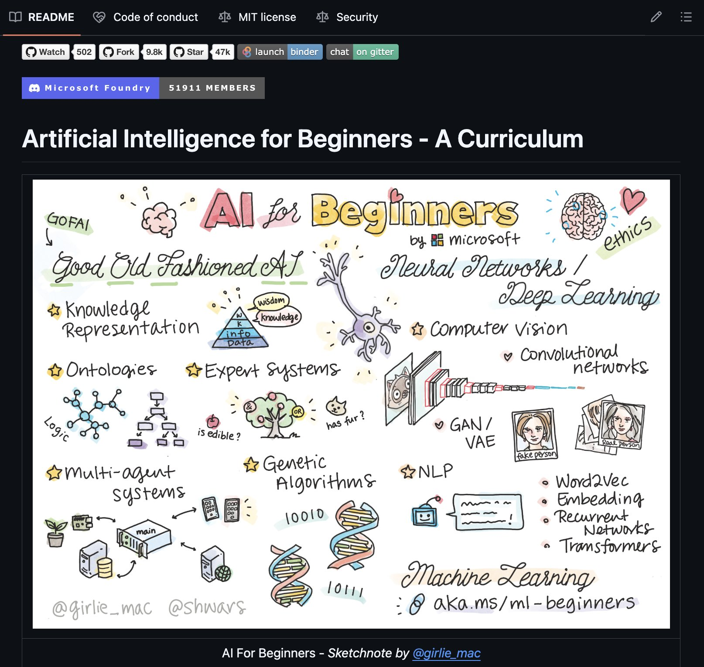

**Bridge to APIs: Anthropic Academy - Building with the Claude API**

anthropic.skilljar.com - Now that you understand models from the inside, learn to use them via API. Covers auth, system prompts, tool use, streaming. The bridge from theory to product.

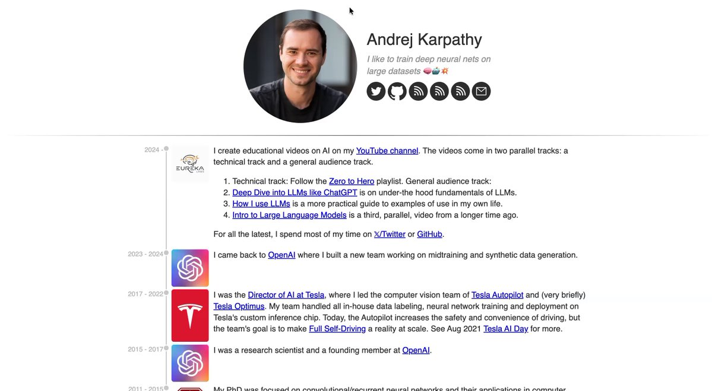

### CHECKPOINT:

You've built a neural network from scratch. You understand backprop, attention, transformers. You can explain how GPT works. You can run models locally with Ollama. You know the Claude API.

## Step 5: LLMs & Prompt Engineering - Work With Real Models (Weeks 9–10)

**Deep Dive: mlabonne/llm-course (LLM Scientist Track)**

github.com/mlabonne/llm-course - The most comprehensive free LLM curriculum. Colab notebooks for every topic.

1. LLM Architecture - connects to what you built with Karpathy
2. Fine-tuning (LoRA, QLoRA) - customize models for specific tasks
3. Quantization - run models locally (connects to your Ollama setup)
4. Evaluation - measure if your model is actually good

### Prompt Engineering

**OpenAI Academy:** academy.openai.com/public/content - "Intro to Prompt Engineering" and "ChatGPT for any role" from the team that built ChatGPT.

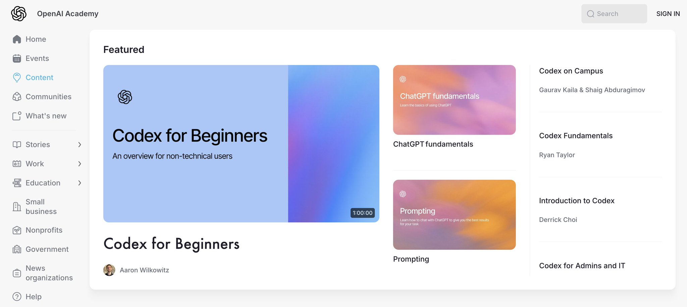

**Anthropic Prompt Engineering:** docs.anthropic.com - Arguably the best-written prompt engineering guide on the internet. Not a course — a deeply detailed reference.

**Continuation: microsoft/generative-ai-for-beginners (Lessons 7–21)**

Go back and finish lessons 7–21. With deep knowledge, these advanced lessons click: RAG, function calling, design patterns, fine-tuning.

**Week 10 Project: Build a RAG over your Obsidian notes**

Use ChromaDB or LanceDB (both free, both local) to index your AI-Learning vault. Build a tool that answers questions about everything you've learned. You're literally building a second brain over your second brain. Push to GitHub.

## Step 6: AI Agents - Build Something Real (Weeks 11–12)

**Primary: microsoft/ai-agents-for-beginners**

github.com/microsoft/ai-agents-for-beginners - 12 lessons: tool use, memory, multi-agent systems, orchestration.

**Deep Dive: Anthropic Academy - MCP Courses**

anthropic.skilljar.com - "Introduction to Model Context Protocol" + "MCP: Advanced Topics." MCP is Anthropic's open standard for connecting AI to external tools — the 2026 standard for agent tool-use. These courses teach you to build MCP servers and clients from scratch.

**Framework: LangGraph (by LangChain)**

Spend 2–3 sessions on LangGraph in free Colab notebooks. It's the most popular framework for building stateful, multi-step agent workflows. Complements the Anthropic MCP approach — LangGraph for orchestration, MCP for tool connections.

**Bonus: Anthropic Cookbook**

docs.anthropic.com/en/docs/about-claude/use-case-guides - The best real-world examples of tool use and MCP patterns. Study these like case studies.

**Final Agent Project:** Build an agent that uses MCP + Claude to work with your local files. Example: an agent that reads your Obsidian vault, checks the web for updates on topics you're studying, and generates a daily summary to your Telegram. Refer to my article "I Built an AI Agent That Manages My Life" for architecture.

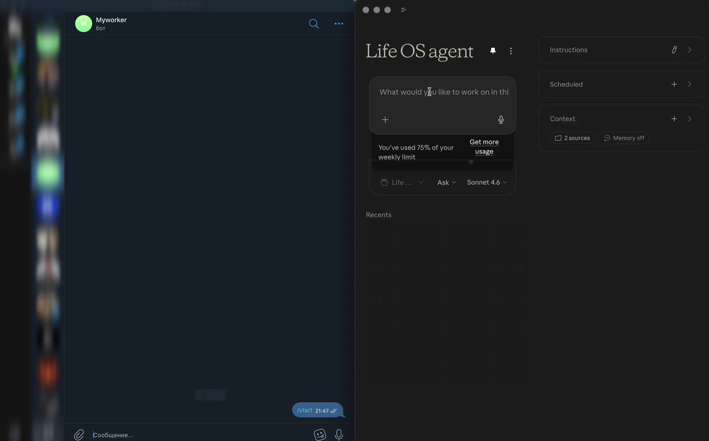

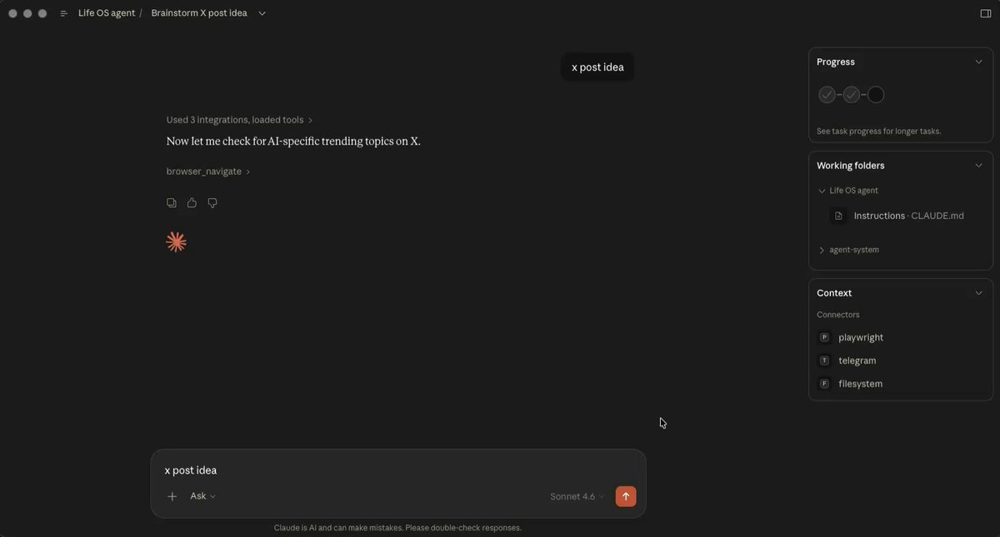

### CHECKPOINT:

You've built a working AI agent with MCP. You understand agent architecture, tool use, and multi-step workflows. Your portfolio grows.

## Step 7: Production, Portfolio & Responsible AI (Weeks 13–14)

### Deploy (all free)

Take your best project and deploy it:

1. **Gradio + Hugging Face Spaces** - fastest way to share an ML demo. Free hosting.
2. **Streamlit Community Cloud** - for data-focused apps. Free tier.
3. **Vercel** - for web-based AI tools. Free tier.

### Evaluate Your Models

A deployed model without evaluation is a liability. Learn to measure quality:

1. **DeepEval** - open-source framework for LLM evaluation.
2. **RAGAS** - specifically for evaluating RAG pipelines (your Obsidian RAG from Step 5).
3. **LLM-as-Judge** - using one LLM to evaluate another's outputs. Claude is excellent for this.

### Responsible AI & Safety

This is where 90% of free guides fail. They teach you to build but not to build *responsibly*.

1. **Constitutional AI** - understand how modern models are aligned. Anthropic's core approach.
2. **Prompt injection defense** - how to protect your apps from adversarial inputs.
3. **Red-teaming** - how to stress-test your own systems before users do.

**Resources:** Anthropic's official safety guide + the Responsible AI course in Anthropic Academy.

### Portfolio & Career

Your GitHub profile IS your resume in AI. Here's how to make it count:

1. **GitHub README** - professional profile README + project READMEs with architecture diagrams and live demo links.
2. **LinkedIn cases** - write 2–3 short case studies about your projects. What problem, what you built, what you learned.
3. **Career tracks** - Junior AI Engineer ($80–120K) → Prompt/Agent Engineer ($120–180K) → AI Product Engineer ($150–250K).

**The Capstone Project:** Build a production-grade AI agent that solves a real problem in your life. Deployed. With an evaluation system. With safety checks. This is what you show employers. This is what you tweet about. This is the proof.

### CHECKPOINT:

You have a deployed, evaluated, safety-checked AI system. Professional GitHub profile. LinkedIn case studies. You're job-ready.

## Maintenance Mode: How to Stay Current

AI moves fast. Here's the weekly ritual to stay ahead after finishing the roadmap:

1. **Monday:** Check Anthropic, OpenAI, and Google release notes. 10 minutes.
2. **Wednesday:** Browse arxiv-sanity-lite for interesting papers. Read 1 abstract. 15 minutes.
3. **Friday:** Watch one Yannic Kilcher or 1littlecoder video on a new paper/tool. 20 minutes.
4. **Monthly:** Build one small project with a new tool or technique. Push to GitHub.

Total time: ~1 hour/week. This keeps you in the top 10% of AI practitioners.

## How This Compares

Honest comparison between this roadmap and the alternatives:

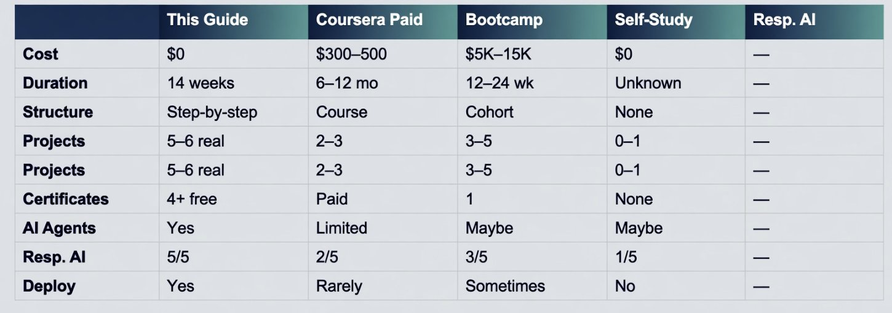

## Complete Resource List

### Free Courses (with certificates)

- **Anthropic Academy** - anthropic.skilljar.com - 16 courses, free certs
- **OpenAI Academy** - academy.openai.com - workshops, tutorials, AI Foundations
- **Google AI Professional Certificate** - grow.google/ai - 7 modules
- **IBM ML on Coursera** - audit mode free - full ML certificate
- **NVIDIA DLI** - developer.nvidia.com/training - GPU & deep learning
- **DeepLearning.AI** - Short courses by Andrew Ng, especially "Agentic AI" and "LangChain for LLM Apps"

### GitHub Repositories

- **microsoft/generative-ai-for-beginners** - 95K★ - 21 lessons GenAI
- **microsoft/ML-For-Beginners** - 45K★ - 12 weeks classic ML
- **microsoft/AI-For-Beginners** - 35K★ - 24 lessons deep learning & CV
- **karpathy/nn-zero-to-hero** - neural nets from scratch by Andrej Karpathy
- **mlabonne/llm-course** - 40K★ - complete LLM roadmap + Colab
- **microsoft/ai-agents-for-beginners** - 12 lessons AI agents
- **ashishpatel26/500-AI-ML-DL-Projects** - 500+ project ideas

### Tools (Free)

- **Ollama + Open WebUI** - run models locally, self-hosted ChatGPT alternative
- **Anthropic Cookbook** - docs.anthropic.com - best tool-use and MCP examples
- **Hugging Face Course (2026)** - especially Agents and Evaluation sections
- **ChromaDB / LanceDB** - free local vector databases for RAG projects

### YouTube (Free)

- **Andrej Karpathy** - "Neural Networks: Zero to Hero"
- **3Blue1Brown** - neural networks & linear algebra visualized
- **Yannic Kilcher** - AI paper breakdowns
- **1littlecoder** - latest AI tools and implementations (2026 focus)
- **Matt Wolfe** - AI news and tool reviews

## Start Tonight

Here's exactly what to do in the next 60 minutes:

1. **Install Obsidian** and create the AI-Learning vault. 5 minutes.
2. **Sign up for Anthropic Academy.** Start AI Fluency. Watch first module. Write first note. 30 minutes.
3. **Fork microsoft/generative-ai-for-beginners** on GitHub. Open Lesson 1. Read it. 20 minutes.

That's it. Three things. Tonight.

The people who will actually learn AI in 2026 aren't the ones who bookmark 50 articles. They're the ones who open a terminal and start.

I started paying $300/month for courses that taught me to copy-paste code I didn't understand. Today I build AI agents for fun and the entire education cost me $0. The resources are right there. The only question is whether you'll start.

---

pls sub me on tg <3 - https://t.me/+y1dBeWEIm_plMGNi


