# Claude Code's Context Management: The 6-Layer Memory Pipeline

**Author:** Troy Hua (@troyhua)
**Source:** https://x.com/troyhua/status/2039052328070734102

A deep dive into Claude Code's context management system from the source code. Covering the 6-layer memory pipeline, the query loop architecture, multi-agent communication patterns, and every key parameter — all extracted directly from the codebase.

---

## The 6-Layer Memory Pipeline (Cheapest → Most Expensive)

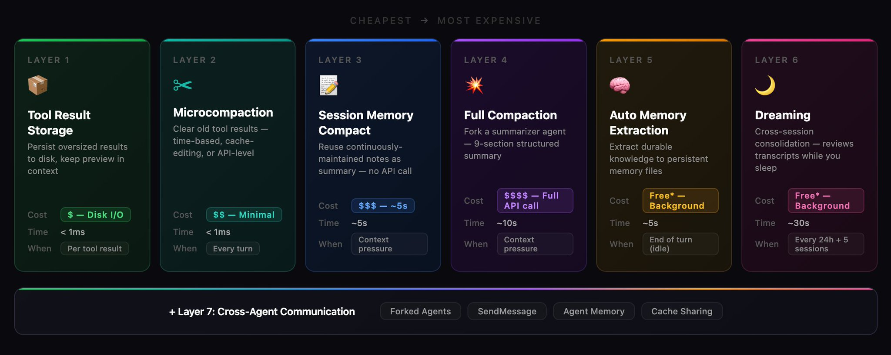

Claude Code manages context through 6 layers, ordered from cheapest to most expensive. Each layer prevents the next, more expensive one from firing.

**Layer 1: Tool Result Storage**
- Persist oversized results to disk, keep preview in context
- Cost: $ — Disk I/O
- Time: < 1ms
- When: Per tool result

**Layer 2: Microcompaction**
- Clear old tool results — time-based, cache-editing, or API-level
- Cost: $$ — Minimal
- Time: < 1ms
- When: Every turn

**Layer 3: Session Memory Compact**
- Reuse continuously-maintained notes as summary — no API call
- Cost: $$$ — ~5s
- Time: ~5s
- When: Context pressure

**Layer 4: Full Compaction**
- Fork a summarizer agent — 9-section structured summary
- Cost: $$$$ — Full API call
- Time: ~10s
- When: Context pressure

**Layer 5: Auto Memory Extraction**
- Extract durable knowledge to persistent memory files
- Cost: Free* — Background
- Time: ~5s
- When: End of turn (idle)

**Layer 6: Dreaming**
- Cross-session consolidation — reviews transcripts while you sleep
- Cost: Free* — Background
- Time: ~30s
- When: Every 24h + 5 sessions

**+ Layer 7: Cross-Agent Communication**
- Forked Agents, SendMessage, Agent Memory, Cache Sharing

---

## Tool Result Size Limits

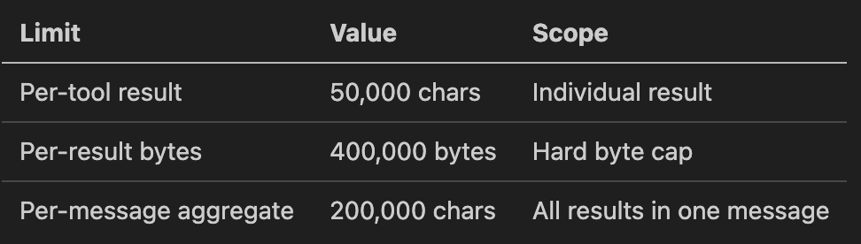

| Limit | Value | Scope |
|-------|-------|-------|
| Per-tool result | 50,000 chars | Individual result |
| Per-result bytes | 400,000 bytes | Hard byte cap |
| Per-message aggregate | 200,000 chars | All results in one message |

---

## Memory Types

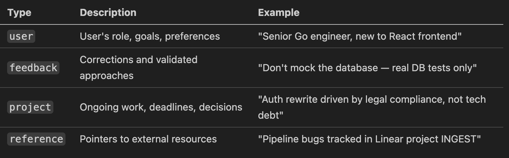

| Type | Description | Example |
|------|-------------|---------|
| `user` | User's role, goals, preferences | "Senior Go engineer, new to React frontend" |
| `feedback` | Corrections and validated approaches | "Don't mock the database — real DB tests only" |
| `project` | Ongoing work, deadlines, decisions | "Auth rewrite driven by legal compliance, not tech debt" |
| `reference` | Pointers to external resources | "Pipeline bugs tracked in Linear project INGEST" |

---

## Dreaming Gate Checks

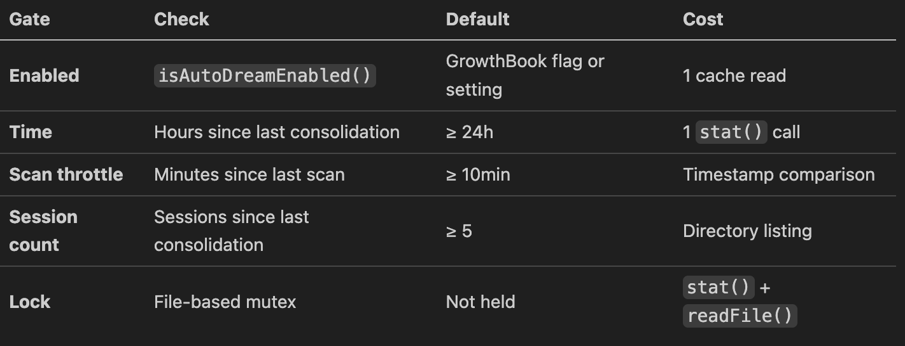

The Dreaming system has 5 gates that must all pass before it fires:

| Gate | Check | Default | Cost |
|------|-------|---------|------|
| Enabled | `isAutoDreamEnabled()` | GrowthBook flag or setting | 1 cache read |
| Time | Hours since last consolidation | ≥ 24h | 1 `stat()` call |
| Scan throttle | Minutes since last scan | ≥ 10min | Timestamp comparison |
| Session count | Sessions since last consolidation | ≥ 5 | Directory listing |
| Lock | File-based mutex | Not held | `stat()` + `readFile()` |

---

## Multi-Agent Patterns

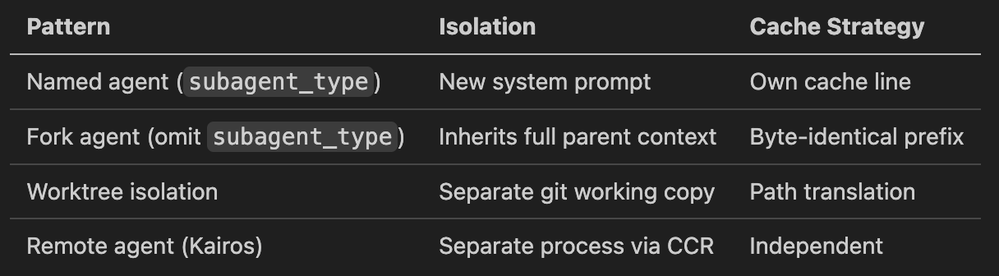

| Pattern | Isolation | Cache Strategy |
|---------|-----------|----------------|
| Named agent (`subagent_type`) | New system prompt | Own cache line |
| Fork agent (omit `subagent_type`) | Inherits full parent context | Byte-identical prefix |
| Worktree isolation | Separate git working copy | Path translation |
| Remote agent (Kairos) | Separate process via CCR | Independent |

---

## Memory Scope

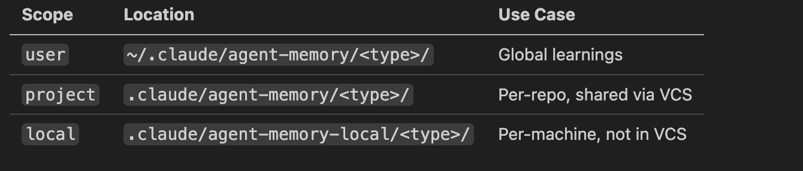

| Scope | Location | Use Case |
|-------|----------|----------|
| `user` | `~/.claude/agent-memory/<type>/` | Global learnings |
| `project` | `.claude/agent-memory/<type>/` | Per-repo, shared via VCS |
| `local` | `.claude/agent-memory-local/<type>/` | Per-machine, not in VCS |

---

## The Query Loop — How It All Fits Together

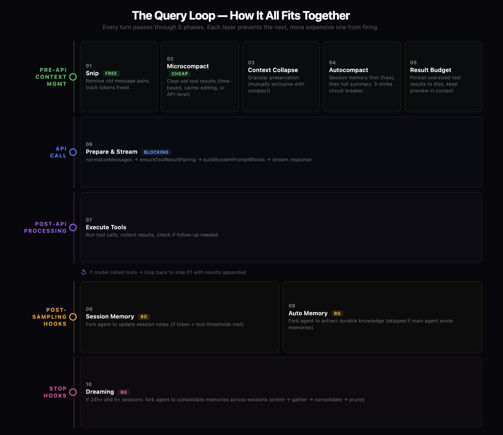

Every turn passes through 5 phases. Each layer prevents the next, more expensive one from firing.

**Pre-API Context Management:**
1. **Snip** (FREE) — Remove old message pairs, track tokens freed
2. **Microcompact** (CHEAP) — Clear old tool results (time-based, cache-editing, or API-level)
3. **Context Collapse** — Granular preservation (mutually exclusive with compact)
4. **Autocompact** — Session memory first (free), then full summary. 3-strike circuit breaker.
5. **Result Budget** — Persist oversized tool results to disk, keep preview in context

**API Call:**
6. **Prepare & Stream** (BLOCKING) — `normalizeMessages` → `ensureToolResultPairing` → `buildSystemPromptBlocks` → stream response

**Post-API Processing:**
7. **Execute Tools** — Run tool calls, collect results, check if follow-up needed
   - If model called tools → loop back to step 01 with results appended

**Post-Sampling Hooks:**
8. **Session Memory** (BG) — Fork agent to update session notes (if token + tool thresholds met)
9. **Auto Memory** (BG) — Fork agent to extract durable knowledge (skipped if main agent wrote memories)

**Stop Hooks:**
10. **Dreaming** (BG) — If 24h+ and 5+ sessions: fork agent to consolidate memories across sessions (orient → gather → consolidate → prune)

---

## Context Window Parameters

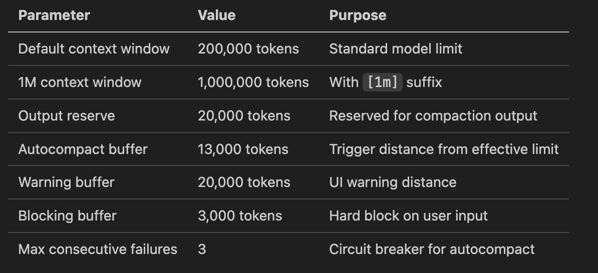

| Parameter | Value | Purpose |
|-----------|-------|---------|
| Default context window | 200,000 tokens | Standard model limit |
| 1M context window | 1,000,000 tokens | With `[1m]` suffix |
| Output reserve | 20,000 tokens | Reserved for compaction output |
| Autocompact buffer | 13,000 tokens | Trigger distance from effective limit |
| Warning buffer | 20,000 tokens | UI warning distance |
| Blocking buffer | 3,000 tokens | Hard block on user input |
| Max consecutive failures | 3 | Circuit breaker for autocompact |

---

## Tool Result Budget Parameters

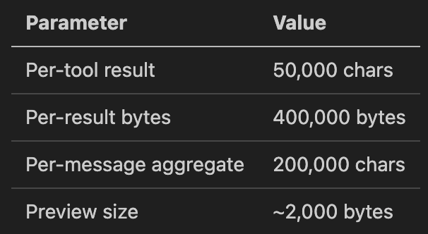

| Parameter | Value |
|-----------|-------|
| Per-tool result | 50,000 chars |
| Per-result bytes | 400,000 bytes |
| Per-message aggregate | 200,000 chars |
| Preview size | ~2,000 bytes |

---

## Session Memory Compaction Parameters

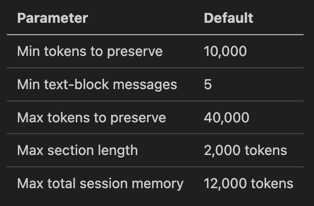

| Parameter | Default |
|-----------|---------|
| Min tokens to preserve | 10,000 |
| Min text-block messages | 5 |
| Max tokens to preserve | 40,000 |
| Max section length | 2,000 tokens |
| Max total session memory | 12,000 tokens |

---

## Full Compaction Parameters

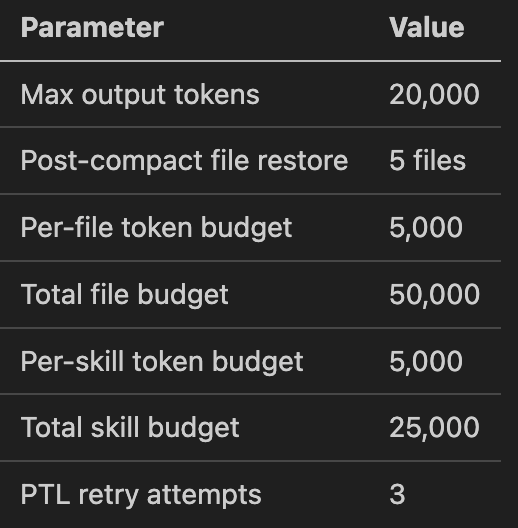

| Parameter | Value |
|-----------|-------|
| Max output tokens | 20,000 |
| Post-compact file restore | 5 files |
| Per-file token budget | 5,000 |
| Total file budget | 50,000 |
| Per-skill token budget | 5,000 |
| Total skill budget | 25,000 |
| PTL retry attempts | 3 |

---

## Dreaming Parameters

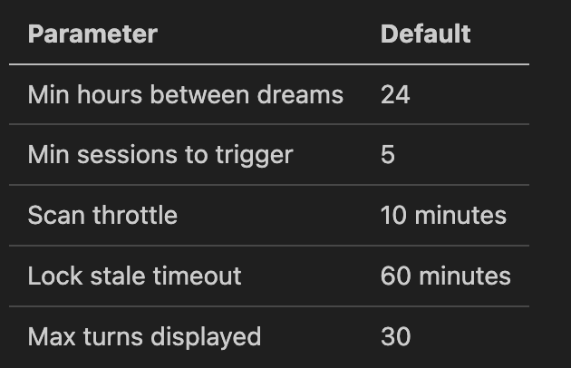

| Parameter | Default |
|-----------|---------|
| Min hours between dreams | 24 |
| Min sessions to trigger | 5 |
| Scan throttle | 10 minutes |
| Lock stale timeout | 60 minutes |
| Max turns displayed | 30 |

---

## Microcompaction Parameters

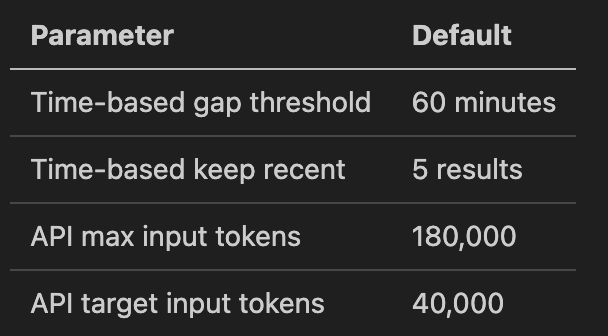

| Parameter | Value |
|-----------|-------|
| Time-based gap threshold | 60 minutes |
| Time-based keep recent | 5 results |
| API max input tokens | 180,000 |
| API target input tokens | 40,000 |
